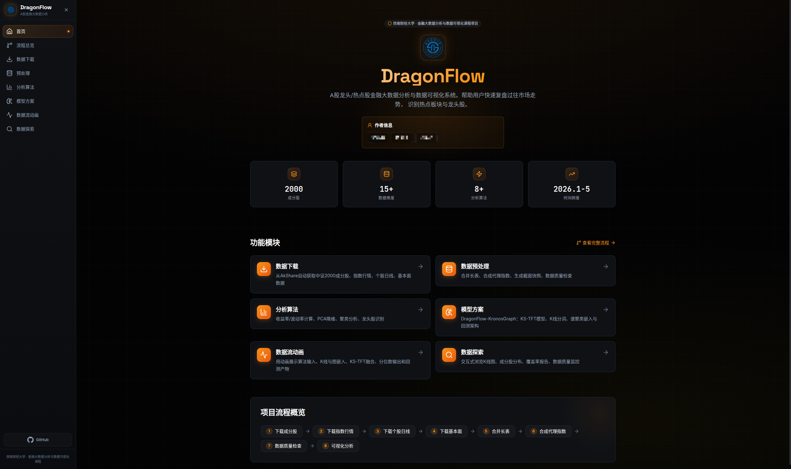
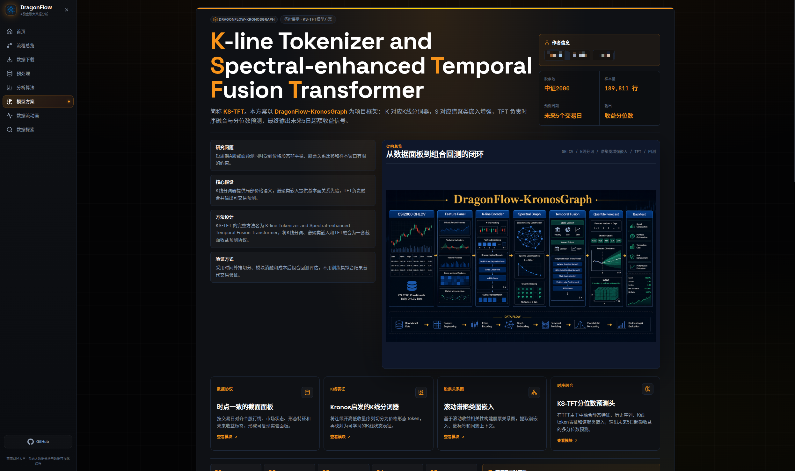

<h1 align="center">DragonFlow</h1>

<p align="center">
<a href="#">

</a>
<a href="#">

</a>
<a href="#">

</a>
<a href="#">

</a>

</p>


A Visualization System for Market Leaders and Theme Rotation

本项目为西南财经大学 《金融大数据分析与数据可视化》 课程项目。

我们团队专注于对热点股、龙头股进行数据可视化分析，并提出了 `KSTFT` 方法用于构建增强指数，帮助用户快速复盘过往市场走势。

基于本项目，我们进行一次Demo Presentation。主题为：**《从夯到拉锐评2026年1至5月热点龙头股》**



## 我们的方法（KSTFT）



## 技术栈

| 模块    | 技术               | 用途          |
| ----- | ---------------- | ----------- |
| 开发语言  | Python           | 主要开发语言     |
| 数据获取  | AkShare          | 获取A股行情/板块数据 |
| 数据处理  | Pandas           | 数据清洗、时间序列处理 |
| 数值计算  | Numpy            | 指标计算        |
| 数据分析  | Scikit-learn     | 机器学习数据分析 |
| 深度学习  | Pytorch          | 深度学习框架 |
| 静态可视化 | Matplotlib       | 数据科学统计图表 |
| 高级可视化 | Pyecharts        | K线图/桑基图/热力图 |
| Web展示 | Streamlit        | 可交互分析平台 |
| 数据存储  | CSV / Parquet / SQLite | 存储历史数据      |
| 脚本环境  | Jupyter Notebook | 数据探索分析      |
| 项目管理  | uv + Git         | 版本管理        |

## 项目结构

```
DragonFlow/
├── app/                              # Streamlit 可视化前端
├── public/                           # 静态资源
├── src/
│   └── dragonflow/                   # 业务核心包
│       ├── data/
│       │   ├── download.py           # 各数据源下载器
│       │   └── schema.py             # 字段映射 / 列名标准化
│       └── utils/
│           ├── io.py                 # 路径、CSV/Parquet 读写
│           └── logger.py             # 统一日志
├── scripts/
│   └── 01_download_csi2000_data.py   # 第一步：数据下载入口
├── data/                             # 数据目录（已在 .gitignore 忽略大文件）
│   ├── raw/
│   │   ├── csi2000/                  # 成分股 / 指数日行情
│   │   ├── stock_daily/qfq/          # 单只股票日线 CSV（断点续跑）
│   │   └── fundamental/              # 基础信息 / 快照 / 财报
│   └── processed/                    # 合并后的长表 + 报告
├── config.yaml                       # 默认配置
└── main.py                           # 主程序
```

## 快速开始

```bash
# 安装依赖（推荐 uv）
uv sync

# 或退化到 pip
pip install -e .
```

## 第一步：下载中证2000数据

> 本步骤只做"数据下载与本地落盘"。不会做收益率/波动率/PCA/聚类/可视化等任何加工。

### 数据来源

- **AkShare**（封装东方财富 / 中证指数 / 新浪等接口）
- 成分股：`index_stock_cons_csindex` → `index_stock_cons` → `index_stock_cons_sina` 自动 fallback
- 指数行情：`index_zh_a_hist` → `stock_zh_index_daily_em` → 新浪 `stock_zh_index_daily` 自动 fallback
- 个股日线：**主源** `stock_zh_a_hist`（EM 前复权），**备源** `stock_zh_a_daily`（新浪），单只失败自动降级
- 个股基础信息：`stock_individual_info_em`
- 截面快照：`stock_zh_a_spot_em` 过滤成分股
- 财报：`stock_lrb_em` / `stock_zcfz_em` / `stock_xjll_em`，优先 `20260331`，自动回退 `20251231 / 20250930 / 20250630`

> ⚠️ **AkShare 大量接口依赖 `*.eastmoney.com` 的 `push2his` 子域名**。如果本机代理 / 防火墙对该域名间歇性掐流，**指数行情**与**个股 K 线**都会失败。
> 这就是为什么我们给个股日线加了**新浪 fallback**（已稳定补齐 2000/2000），并给指数行情加了**本地等权重代理合成**（见下）作为兜底。

### 默认时间窗口

- `start_date = 2026-01-01`
- `end_date   = 2026-05-31`

### 运行命令

```bash
# uv 用户
uv run python scripts/01_download_csi2000_data.py \
  --start-date 2026-01-01 \
  --end-date 2026-05-31 \
  --index-code 932000 \
  --adjust qfq

# 或直接 python
python scripts/01_download_csi2000_data.py \
  --start-date 2026-01-01 \
  --end-date 2026-05-31 \
  --index-code 932000 \
  --adjust qfq
```

### 命令行参数

| 参数 | 默认 | 说明 |
| --- | --- | --- |
| `--start-date` | `2026-01-01` | 起始日期 |
| `--end-date` | `2026-05-31` | 结束日期 |
| `--index-code` | `932000` | 指数代码 |
| `--adjust` | `qfq` | 复权方式：`qfq` / `hfq` / `""` |
| `--force` | `False` | 忽略已存在的单只股票 CSV，强制重新下载 |
| `--sleep` | `0.3` | 单只股票请求之间的间隔秒数 |
| `--max-workers` | `1` | 并发数（当前串行；预留） |
| `--skip-fundamental` | `False` | 跳过基础信息/快照/财报（只跑行情） |
| `--limit` | `0` | 仅下载前 N 只成分股（冒烟测试用，0=全部） |

### 输出文件

```
data/raw/csi2000/
  constituents_932000_YYYYMMDD.csv
  constituents_932000_latest.csv
  index_daily_932000_20260101_20260531.csv
  index_daily_932000_20260101_20260531.parquet

data/raw/stock_daily/qfq/
  {stock_code}.csv          # 一只股票一个文件，断点续跑

data/raw/fundamental/
  stock_info_csi2000_YYYYMMDD.csv
  stock_spot_snapshot_YYYYMMDD.csv
  profit_YYYYMMDD.csv
  balance_YYYYMMDD.csv
  cashflow_YYYYMMDD.csv

data/processed/
  stock_daily_csi2000_qfq_20260101_20260531.csv
  stock_daily_csi2000_qfq_20260101_20260531.parquet
  stock_info_csi2000_latest.parquet
  stock_spot_snapshot_csi2000_latest.parquet
  fundamental_csi2000_latest.parquet
  fundamental_csi2000_latest.csv
  data_coverage_report.csv
  download_manifest.json
  download_errors.csv
```

### 常见问题

- **接口失败 / 网络慢**：脚本对成分股、指数行情、财报都配置了多接口 fallback。临时性失败可以直接重跑（默认会跳过已下载文件，断点续跑）。
- **部分股票缺失**：停牌、退市、新上市的个股可能某个时段没数据；脚本会写入 `data/processed/download_errors.csv` 记录原因，且会在 `data_coverage_report.csv` 中体现覆盖率。
- **如何断点续跑**：直接重跑同样的命令即可，`data/raw/stock_daily/qfq/{code}.csv` 已存在的股票会自动跳过。需要刷新某段数据时加 `--force`。
- **AkShare 限流**：可加大 `--sleep`（如 0.5/1.0）减小请求频率。
- **首次冒烟测试**：可以加 `--limit 20 --skip-fundamental` 只下载 20 只成分股的日线，快速验证环境。

### 不要做的事情（本步骤约束）

- 不计算收益率 / 波动率 / 最大回撤 / FFT / PCA / 聚类
- 不修改 Streamlit 前端
- 不把大型原始数据提交到 git（默认 `.gitignore` 排除 `data/raw` 与 `data/processed`；当前仓库的数据快照是手动 `git add -f` 上传的）

---

## 当前仓库里已经有什么数据（2026-06-08 快照）

这一份数据是 2026-01 ~ 05 的 csi2000 行情画像所需的全部"第一步"产出，**下一位同学 clone 之后无需再下载**就能直接开干。
某些数据因 EM 代理偶发掐流没能拿到官方版，已用本地合成代理顶替——具体见下表："来源"列里凡是 `computed_local_*` / `derived_from_*` 的都是本地合成产物，**不是官方接口数据**，做学术报告时请如实标注。

| 数据 | 状态 | 文件 | 行数 | 来源 |
|---|---|---|---|---|
| 中证2000成分股 | ✅ 100% | `data/raw/csi2000/constituents_932000_*.csv` | 2000 | 中证指数 `index_stock_cons_csindex` |
| **个股日线** (前复权) | ✅ **100%** | `data/raw/stock_daily/qfq/*.csv` + `data/processed/stock_daily_csi2000_qfq_*.csv/.parquet` | 2000 只 / 189,811 行 | EM `stock_zh_a_hist` 优先 + 新浪 `stock_zh_a_daily` 兜底 |
| **中证2000指数日线（官方）** | ✅ **100%** | `data/raw/csi2000/index_daily_932000_*.csv/.parquet` | **95** | EM `stock_zh_index_daily_em(csi932000)` |
| 中证2000指数日线（本地代理） | ✅ 备用 | `data/processed/index_daily_932000_proxy_equal_weight_*.csv/.parquet` | 94 | `computed_local_equal_weight_proxy`（成分股等权日收益累乘）—— 与官方版并存供对照 |
| 个股基础信息 | ⚠️ 68.6% | `data/raw/fundamental/stock_info_csi2000_*.csv` + `data/processed/stock_info_csi2000_latest.parquet` | **1371 / 2000** | EM `stock_individual_info_em`，剩 629 只仍受代理偶发断流影响 |
| 截面快照（官方） | ❌ 0 | 无（EM `82.push2` 子域分页第 4-10 页必断；akshare 没有可分批的替代接口） | — | — |
| **截面快照（本地合成）** | ✅ 替代 | `data/processed/stock_spot_snapshot_csi2000_latest.csv/.parquet` | 2000 | `derived_from_last_daily_row`（取每只股票合并长表里最后一个交易日的数据） |
| 利润表 (2026Q1) | ✅ | `data/raw/fundamental/profit_20260331.csv` + 合并到 `fundamental_csi2000_latest.*` | ~2000 | EM `stock_lrb_em` |
| 资产负债表 (2026Q1) | ✅ | `data/raw/fundamental/balance_20260331.csv` + 合并到 `fundamental_csi2000_latest.*` | ~2000 | EM `stock_zcfz_em` |
| 现金流量表 (2026Q1) | ✅ | `data/raw/fundamental/cashflow_20260331.csv` + 合并到 `fundamental_csi2000_latest.*` | ~2000 | EM `stock_xjll_em` |

报告与日志：
- `data/processed/download_manifest.json` — 每次主脚本运行的元数据
- `data/processed/download_errors.csv` — 失败明细（stage / stock_code / error_type / error_message / time）
- `data/processed/data_coverage_report.csv` — 每只成分股的覆盖率（n_daily_rows / first_date / last_date / missing_ratio / download_success）

### 本地合成产物的脚本

```bash
# 等权重 csi2000 代理指数（依赖合并长表）
uv run python scripts/03_synthesize_index_proxy.py

# 截面快照（取每只股票最后一个交易日）
uv run python scripts/04_synthesize_spot_snapshot.py
```

两个合成脚本都是**只读 + 输出到 `data/processed/`**，可以随时安全重跑。

### 想再补齐的数据该怎么做

1. **stock_info 剩 629 只**：直接跑 `_oneshot_fill_stock_info.py`，它会读现有 CSV 并只查缺失的成分股（增量、可重复运行）：
   ```bash
   uv run python scripts/_oneshot_fill_stock_info.py
   ```
2. **官方指数日线（如果之后被刷新或要换日期）**：跑 `_oneshot_fetch_index.py`，含多次重试：
   ```bash
   uv run python scripts/_oneshot_fetch_index.py
   ```
3. **官方截面快照**：等 `82.push2.eastmoney.com` 恢复后跑：
   ```bash
   uv run python -c "
   import sys; sys.path.insert(0,'src')
   import pandas as pd
   from dragonflow.data.download import download_spot_snapshot
   cons = pd.read_csv('data/raw/csi2000/constituents_932000_latest.csv', dtype={'stock_code':str}, encoding='utf-8-sig')
   df, _ = download_spot_snapshot(constituent_codes=cons['stock_code'])
   df.to_csv('data/processed/stock_spot_snapshot_csi2000_official.csv', index=False, encoding='utf-8-sig')
   df.to_parquet('data/processed/stock_spot_snapshot_csi2000_official.parquet', index=False)
   "
   ```

### 下一位同学可以直接开始的画像工作

成分股、个股日线、财报三表、个股基础信息（≥47%）、合成代理指数、合成快照——这些组合起来已经可以支持以下分析：

- **收益 / 趋势**：从 `stock_daily_csi2000_qfq_*.parquet` 起步，按 stock_code 分组算累计收益、N 日动量、SMA/EMA 斜率
- **相对市场**：以 `index_daily_932000_proxy_equal_weight_*.parquet` 为基准，计算个股超额、Beta、相关系数
- **波动 / 风险**：日波动率、下行波动、最大回撤、Calmar、Sharpe
- **流动性**：换手率分位、`amount` / `amplitude` 截面分布
- **截面特征**：用 `fundamental_csi2000_latest.parquet` 接入 ROE / 资产负债率 / 营收同比等做"基本面分层"
- **形态聚类**：每只标准化日收益曲线 → PCA → KMeans/DBSCAN 给出"龙头形态 / 震荡形态 / 破位形态"等标签

所有 schema 字段命名见 `src/dragonflow/data/schema.py`，加载方式见 `src/dragonflow/utils/io.py`（`load_csv_codes` 自动把 `stock_code` 保留为 6 位字符串）。
