# DragonFlow — 中证2000成分股画像分析

**从夯到拉锐评2026年1至5月热点龙头股**

本 Notebook 从大盘全景、风险收益、量价异动、聚类画像和典型个股五个角度，系统描述中证2000成分股的市场行为特征。

---


```python
import sys
from pathlib import Path

_REPO_ROOT = Path.cwd().parent if Path.cwd().name == "notebooks" else Path.cwd()
_SRC = _REPO_ROOT / "src"
if str(_SRC) not in sys.path:
    sys.path.insert(0, str(_SRC))

import warnings
warnings.filterwarnings("ignore")

import numpy as np
import pandas as pd
import matplotlib.pyplot as plt

plt.rcParams["font.sans-serif"] = ["SimHei", "Microsoft YaHei", "PingFang SC", "DejaVu Sans"]
plt.rcParams["axes.unicode_minus"] = False

from dragonflow.utils.io import resolve_path
```

## 0. 数据加载


```python
def load_csv(name, path_str):
    p = resolve_path(path_str)
    if not p.exists():
        print(f"  x {name} 不存在: {p}")
        return None
    df = pd.read_csv(p, dtype={"stock_code": str}, encoding="utf-8-sig")
    if "stock_code" in df.columns:
        df["stock_code"] = df["stock_code"].astype(str).str.zfill(6)
    print(f"  v {name}: {len(df):,} 行")
    return df

print("数据加载状态：")
daily_df = load_csv("日线数据", "data/processed/stock_daily_csi2000_qfq_20260101_20260531_clean.csv")
index_daily = load_csv("指数日线", "data/processed/index_daily_932000_20260101_20260531.csv")
features_df = load_csv("特征表", "data/processed/stock_features.csv")
clusters_df = load_csv("聚类结果", "data/processed/stock_clusters.csv")
pca_df = load_csv("PCA坐标", "data/processed/pca_2d.csv")
k_search_df = load_csv("K搜索", "data/processed/k_search.csv")

if clusters_df is not None:
    features_df = clusters_df
```

    数据加载状态：
      v 日线数据: 189,811 行
      v 指数日线: 95 行
      v 特征表: 2,000 行
      v 聚类结果: 2,000 行
      v PCA坐标: 2,000 行
      v K搜索: 8 行
    

---
## Chapter 1: 大盘全景

先从宏观角度看中证2000在2026年1-5月的整体表现。


```python
# 图1: 中证2000指数走势 + MA均线
from dragonflow.viz.charts_pyecharts import chart_index_line

if index_daily is not None:
    chart_index_line(index_daily).render_notebook()
else:
    print("指数日线数据未加载")
```


```python
# 图2: 每日涨跌家数堆叠柱状图
from dragonflow.viz.charts_pyecharts import chart_daily_up_down_bar

chart_daily_up_down_bar(daily_df).render_notebook()
```


<script>
    require.config({
        paths: {
            'echarts':'https://assets.pyecharts.org/assets/v6/echarts.min'
        }
    });
</script>

        <div id="8251a65502054936ac7976e61030f268" style="width:1000px; height:400px;"></div>

<script>
        require(['echarts'], function(echarts) {
                var chart_8251a65502054936ac7976e61030f268 = echarts.init(
                    document.getElementById('8251a65502054936ac7976e61030f268'), 'white', {renderer: 'canvas', locale: 'ZH'});
                var option_8251a65502054936ac7976e61030f268 = {
    "animation": true,
    "animationThreshold": 2000,
    "animationDuration": 1000,
    "animationEasing": "cubicOut",
    "animationDelay": 0,
    "animationDurationUpdate": 300,
    "animationEasingUpdate": "cubicOut",
    "animationDelayUpdate": 0,
    "aria": {
        "enabled": false
    },
    "series": [
        {
            "type": "bar",
            "name": "\u4e0a\u6da8",
            "legendHoverLink": true,
            "data": [
                839,
                834,
                449,
                851,
                796,
                901,
                283,
                592,
                416,
                531,
                793,
                414,
                640,
                775,
                813,
                294,
                371,
                308,
                320,
                565,
                164,
                1035,
                669,
                307,
                627,
                958,
                470,
                354,
                429,
                331,
                845,
                757,
                537,
                684,
                162,
                102,
                419,
                884,
                871,
                297,
                951,
                371,
                242,
                284,
                655,
                124,
                823,
                80,
                98,
                56,
                1076,
                1019,
                171,
                934,
                621,
                198,
                900,
                186,
                114,
                892,
                1062,
                227,
                788,
                474,
                779,
                307,
                916,
                464,
                714,
                354,
                556,
                236,
                417,
                754,
                284,
                805,
                617,
                839,
                734,
                809,
                610,
                225,
                721,
                200,
                405,
                465,
                744,
                281,
                119,
                878,
                406,
                204,
                159,
                710,
                233
            ],
            "realtimeSort": false,
            "showBackground": false,
            "stack": "total",
            "stackStrategy": "samesign",
            "cursor": "pointer",
            "barMinHeight": 0,
            "barCategoryGap": "20%",
            "barGap": "30%",
            "large": false,
            "largeThreshold": 400,
            "seriesLayoutBy": "column",
            "datasetIndex": 0,
            "clip": true,
            "zlevel": 0,
            "z": 2,
            "label": {
                "show": false,
                "margin": 8,
                "richInheritPlainLabel": true,
                "valueAnimation": false
            },
            "itemStyle": {
                "color": "#d62728"
            }
        },
        {
            "type": "bar",
            "name": "\u5e73\u76d8",
            "legendHoverLink": true,
            "data": [
                20,
                30,
                19,
                17,
                47,
                31,
                15,
                25,
                18,
                20,
                7,
                27,
                43,
                21,
                23,
                12,
                20,
                15,
                14,
                26,
                6,
                8,
                19,
                22,
                41,
                15,
                25,
                43,
                12,
                26,
                16,
                24,
                25,
                17,
                5,
                3,
                29,
                21,
                6,
                16,
                11,
                27,
                18,
                36,
                27,
                10,
                16,
                0,
                1,
                0,
                4,
                8,
                9,
                12,
                23,
                21,
                27,
                10,
                3,
                6,
                1,
                5,
                35,
                40,
                48,
                14,
                20,
                20,
                43,
                25,
                24,
                18,
                21,
                24,
                22,
                21,
                25,
                20,
                33,
                24,
                28,
                9,
                24,
                7,
                18,
                32,
                30,
                13,
                2,
                19,
                23,
                8,
                8,
                29,
                15
            ],
            "realtimeSort": false,
            "showBackground": false,
            "stack": "total",
            "stackStrategy": "samesign",
            "cursor": "pointer",
            "barMinHeight": 0,
            "barCategoryGap": "20%",
            "barGap": "30%",
            "large": false,
            "largeThreshold": 400,
            "seriesLayoutBy": "column",
            "datasetIndex": 0,
            "clip": true,
            "zlevel": 0,
            "z": 2,
            "label": {
                "show": false,
                "margin": 8,
                "richInheritPlainLabel": true,
                "valueAnimation": false
            },
            "itemStyle": {
                "color": "#cccccc"
            }
        },
        {
            "type": "bar",
            "name": "\u4e0b\u8dcc",
            "legendHoverLink": true,
            "data": [
                258,
                252,
                647,
                247,
                271,
                183,
                815,
                495,
                679,
                563,
                315,
                676,
                434,
                321,
                281,
                809,
                724,
                791,
                780,
                523,
                946,
                73,
                429,
                787,
                447,
                142,
                620,
                718,
                675,
                758,
                254,
                334,
                552,
                414,
                948,
                1011,
                668,
                211,
                239,
                804,
                154,
                719,
                857,
                797,
                435,
                983,
                278,
                1037,
                1018,
                1061,
                36,
                89,
                935,
                169,
                471,
                895,
                187,
                917,
                996,
                217,
                52,
                883,
                293,
                602,
                289,
                795,
                180,
                632,
                359,
                737,
                535,
                861,
                677,
                338,
                811,
                291,
                475,
                257,
                349,
                283,
                478,
                882,
                372,
                910,
                694,
                620,
                343,
                823,
                996,
                220,
                688,
                905,
                950,
                378,
                869
            ],
            "realtimeSort": false,
            "showBackground": false,
            "stack": "total",
            "stackStrategy": "samesign",
            "cursor": "pointer",
            "barMinHeight": 0,
            "barCategoryGap": "20%",
            "barGap": "30%",
            "large": false,
            "largeThreshold": 400,
            "seriesLayoutBy": "column",
            "datasetIndex": 0,
            "clip": true,
            "zlevel": 0,
            "z": 2,
            "label": {
                "show": false,
                "margin": 8,
                "richInheritPlainLabel": true,
                "valueAnimation": false
            },
            "itemStyle": {
                "color": "#2ca02c"
            }
        }
    ],
    "legend": [
        {
            "data": [
                "\u4e0a\u6da8",
                "\u5e73\u76d8",
                "\u4e0b\u8dcc"
            ],
            "selected": {},
            "show": true,
            "padding": 5,
            "itemGap": 10,
            "itemWidth": 25,
            "itemHeight": 14,
            "backgroundColor": "transparent",
            "borderColor": "#ccc",
            "borderRadius": 0,
            "pageButtonItemGap": 5,
            "pageButtonPosition": "end",
            "pageFormatter": "{current}/{total}",
            "pageIconColor": "#2f4554",
            "pageIconInactiveColor": "#aaa",
            "pageIconSize": 15,
            "animationDurationUpdate": 800,
            "selector": false,
            "selectorPosition": "auto",
            "selectorItemGap": 7,
            "selectorButtonGap": 10,
            "triggerEvent": false
        }
    ],
    "tooltip": {
        "show": true,
        "trigger": "axis",
        "triggerOn": "mousemove|click",
        "axisPointer": {
            "type": "line"
        },
        "showContent": true,
        "alwaysShowContent": false,
        "showDelay": 0,
        "hideDelay": 100,
        "enterable": false,
        "confine": false,
        "appendToBody": false,
        "transitionDuration": 0.4,
        "displayTransition": true,
        "textStyle": {
            "fontSize": 14,
            "richInheritPlainLabel": true
        },
        "borderWidth": 0,
        "padding": 5,
        "order": "seriesAsc"
    },
    "xAxis": [
        {
            "show": true,
            "scale": false,
            "nameLocation": "end",
            "nameGap": 15,
            "nameTruncate": {},
            "nameMoveOverlap": true,
            "inverse": false,
            "offset": 0,
            "splitNumber": 5,
            "minInterval": 0,
            "silent": false,
            "triggerEvent": false,
            "splitLine": {
                "show": true,
                "lineStyle": {
                    "show": false
                }
            },
            "animation": true,
            "animationThreshold": 2000,
            "animationDuration": 1000,
            "animationEasing": "cubicOut",
            "animationDelay": 0,
            "animationDurationUpdate": 300,
            "animationEasingUpdate": "cubicOut",
            "animationDelayUpdate": 0,
            "data": [
                "2026-01-05",
                "2026-01-06",
                "2026-01-07",
                "2026-01-08",
                "2026-01-09",
                "2026-01-12",
                "2026-01-13",
                "2026-01-14",
                "2026-01-15",
                "2026-01-16",
                "2026-01-19",
                "2026-01-20",
                "2026-01-21",
                "2026-01-22",
                "2026-01-23",
                "2026-01-26",
                "2026-01-27",
                "2026-01-28",
                "2026-01-29",
                "2026-01-30",
                "2026-02-02",
                "2026-02-03",
                "2026-02-04",
                "2026-02-05",
                "2026-02-06",
                "2026-02-09",
                "2026-02-10",
                "2026-02-11",
                "2026-02-12",
                "2026-02-13",
                "2026-02-24",
                "2026-02-25",
                "2026-02-26",
                "2026-02-27",
                "2026-03-02",
                "2026-03-03",
                "2026-03-04",
                "2026-03-05",
                "2026-03-06",
                "2026-03-09",
                "2026-03-10",
                "2026-03-11",
                "2026-03-12",
                "2026-03-13",
                "2026-03-16",
                "2026-03-17",
                "2026-03-18",
                "2026-03-19",
                "2026-03-20",
                "2026-03-23",
                "2026-03-24",
                "2026-03-25",
                "2026-03-26",
                "2026-03-27",
                "2026-03-30",
                "2026-03-31",
                "2026-04-01",
                "2026-04-02",
                "2026-04-03",
                "2026-04-07",
                "2026-04-08",
                "2026-04-09",
                "2026-04-10",
                "2026-04-13",
                "2026-04-14",
                "2026-04-15",
                "2026-04-16",
                "2026-04-17",
                "2026-04-20",
                "2026-04-21",
                "2026-04-22",
                "2026-04-23",
                "2026-04-24",
                "2026-04-27",
                "2026-04-28",
                "2026-04-29",
                "2026-04-30",
                "2026-05-06",
                "2026-05-07",
                "2026-05-08",
                "2026-05-11",
                "2026-05-12",
                "2026-05-13",
                "2026-05-14",
                "2026-05-15",
                "2026-05-18",
                "2026-05-19",
                "2026-05-20",
                "2026-05-21",
                "2026-05-22",
                "2026-05-25",
                "2026-05-26",
                "2026-05-27",
                "2026-05-28",
                "2026-05-29"
            ]
        }
    ],
    "yAxis": [
        {
            "name": "\u5bb6\u6570",
            "show": true,
            "scale": false,
            "nameLocation": "end",
            "nameGap": 15,
            "nameTruncate": {},
            "nameMoveOverlap": true,
            "inverse": false,
            "offset": 0,
            "splitNumber": 5,
            "minInterval": 0,
            "silent": false,
            "triggerEvent": false,
            "splitLine": {
                "show": true,
                "lineStyle": {
                    "show": false
                }
            },
            "animation": true,
            "animationThreshold": 2000,
            "animationDuration": 1000,
            "animationEasing": "cubicOut",
            "animationDelay": 0,
            "animationDurationUpdate": 300,
            "animationEasingUpdate": "cubicOut",
            "animationDelayUpdate": 0
        }
    ],
    "title": [
        {
            "show": true,
            "text": "\u6bcf\u65e5\u6da8\u8dcc\u5bb6\u6570",
            "target": "blank",
            "subtarget": "blank",
            "padding": 5,
            "itemGap": 10,
            "textAlign": "auto",
            "textVerticalAlign": "auto",
            "triggerEvent": false
        }
    ],
    "dataZoom": [
        {
            "show": true,
            "type": "slider",
            "showDetail": true,
            "showDataShadow": true,
            "realtime": true,
            "start": 0,
            "end": 100,
            "orient": "horizontal",
            "zoomLock": false,
            "filterMode": "filter"
        }
    ]
};
                chart_8251a65502054936ac7976e61030f268.setOption(option_8251a65502054936ac7976e61030f268);
        });
    </script>


```python
# 图3: 月度收益率分布小提琴图
from dragonflow.viz.charts_matplotlib import plot_monthly_return_violin

fig = plot_monthly_return_violin(daily_df)
plt.show()
plt.close(fig)
```


    
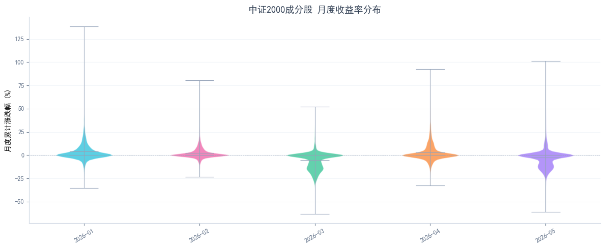
    


```python
# 图4: 累计收益率 Top20 / Bottom20
from dragonflow.viz.charts_matplotlib import plot_top_bottom_returns

fig = plot_top_bottom_returns(features_df)
plt.show()
plt.close(fig)
```


    
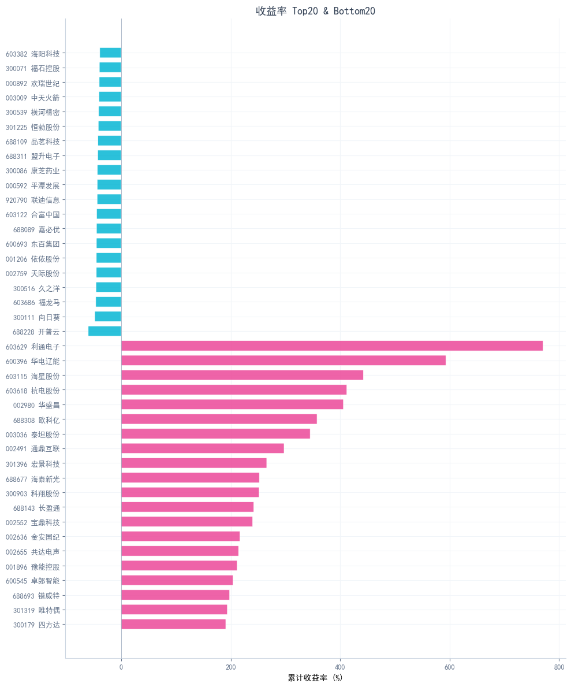
    


```python
# 图5: 全市场日成交额走势
from dragonflow.viz.charts_pyecharts import chart_daily_amount_area

chart_daily_amount_area(daily_df).render_notebook()
```


<script>
    require.config({
        paths: {
            'echarts':'https://assets.pyecharts.org/assets/v6/echarts.min'
        }
    });
</script>

        <div id="e6e8012474ef4f1d8625af3773ca9dc0" style="width:1000px; height:400px;"></div>

<script>
        require(['echarts'], function(echarts) {
                var chart_e6e8012474ef4f1d8625af3773ca9dc0 = echarts.init(
                    document.getElementById('e6e8012474ef4f1d8625af3773ca9dc0'), 'white', {renderer: 'canvas', locale: 'ZH'});
                var option_e6e8012474ef4f1d8625af3773ca9dc0 = {
    "animation": true,
    "animationThreshold": 2000,
    "animationDuration": 1000,
    "animationEasing": "cubicOut",
    "animationDelay": 0,
    "animationDurationUpdate": 300,
    "animationEasingUpdate": "cubicOut",
    "animationDelayUpdate": 0,
    "aria": {
        "enabled": false
    },
    "series": [
        {
            "type": "line",
            "name": "\u6210\u4ea4\u989d\uff08\u4ebf\u5143\uff09",
            "connectNulls": false,
            "xAxisIndex": 0,
            "symbolSize": 4,
            "showSymbol": true,
            "smooth": true,
            "clip": true,
            "step": false,
            "stackStrategy": "samesign",
            "data": [
                [
                    "2026-01-05",
                    5519.24
                ],
                [
                    "2026-01-06",
                    5894.75
                ],
                [
                    "2026-01-07",
                    6161.13
                ],
                [
                    "2026-01-08",
                    6234.92
                ],
                [
                    "2026-01-09",
                    7091.2
                ],
                [
                    "2026-01-12",
                    8062.41
                ],
                [
                    "2026-01-13",
                    8205.85
                ],
                [
                    "2026-01-14",
                    8568.85
                ],
                [
                    "2026-01-15",
                    6267.18
                ],
                [
                    "2026-01-16",
                    6318.07
                ],
                [
                    "2026-01-19",
                    5932.75
                ],
                [
                    "2026-01-20",
                    6105.15
                ],
                [
                    "2026-01-21",
                    5544.56
                ],
                [
                    "2026-01-22",
                    5680.27
                ],
                [
                    "2026-01-23",
                    6557.36
                ],
                [
                    "2026-01-26",
                    6813.77
                ],
                [
                    "2026-01-27",
                    5970.05
                ],
                [
                    "2026-01-28",
                    5759.21
                ],
                [
                    "2026-01-29",
                    6240.6
                ],
                [
                    "2026-01-30",
                    5655.27
                ],
                [
                    "2026-02-02",
                    5251.67
                ],
                [
                    "2026-02-03",
                    5146.22
                ],
                [
                    "2026-02-04",
                    5214.28
                ],
                [
                    "2026-02-05",
                    4700.65
                ],
                [
                    "2026-02-06",
                    4971.77
                ],
                [
                    "2026-02-09",
                    5209.57
                ],
                [
                    "2026-02-10",
                    4957.92
                ],
                [
                    "2026-02-11",
                    4515.36
                ],
                [
                    "2026-02-12",
                    4802.83
                ],
                [
                    "2026-02-13",
                    4317.51
                ],
                [
                    "2026-02-24",
                    4834.72
                ],
                [
                    "2026-02-25",
                    5148.82
                ],
                [
                    "2026-02-26",
                    5432.38
                ],
                [
                    "2026-02-27",
                    5270.19
                ],
                [
                    "2026-03-02",
                    6274.0
                ],
                [
                    "2026-03-03",
                    6481.98
                ],
                [
                    "2026-03-04",
                    4988.37
                ],
                [
                    "2026-03-05",
                    5355.43
                ],
                [
                    "2026-03-06",
                    5056.73
                ],
                [
                    "2026-03-09",
                    5520.1
                ],
                [
                    "2026-03-10",
                    5349.49
                ],
                [
                    "2026-03-11",
                    5566.86
                ],
                [
                    "2026-03-12",
                    5209.18
                ],
                [
                    "2026-03-13",
                    4983.76
                ],
                [
                    "2026-03-16",
                    4809.83
                ],
                [
                    "2026-03-17",
                    4713.12
                ],
                [
                    "2026-03-18",
                    4396.82
                ],
                [
                    "2026-03-19",
                    4511.75
                ],
                [
                    "2026-03-20",
                    4779.39
                ],
                [
                    "2026-03-23",
                    5036.57
                ],
                [
                    "2026-03-24",
                    4535.46
                ],
                [
                    "2026-03-25",
                    4627.99
                ],
                [
                    "2026-03-26",
                    4463.29
                ],
                [
                    "2026-03-27",
                    4231.0
                ],
                [
                    "2026-03-30",
                    4358.39
                ],
                [
                    "2026-03-31",
                    4549.77
                ],
                [
                    "2026-04-01",
                    4665.4
                ],
                [
                    "2026-04-02",
                    4477.85
                ],
                [
                    "2026-04-03",
                    4122.67
                ],
                [
                    "2026-04-07",
                    3910.05
                ],
                [
                    "2026-04-08",
                    5112.93
                ],
                [
                    "2026-04-09",
                    4924.95
                ],
                [
                    "2026-04-10",
                    4954.29
                ],
                [
                    "2026-04-13",
                    4602.37
                ],
                [
                    "2026-04-14",
                    5115.45
                ],
                [
                    "2026-04-15",
                    5351.77
                ],
                [
                    "2026-04-16",
                    5366.03
                ],
                [
                    "2026-04-17",
                    5500.3
                ],
                [
                    "2026-04-20",
                    5812.17
                ],
                [
                    "2026-04-21",
                    5559.5
                ],
                [
                    "2026-04-22",
                    5701.77
                ],
                [
                    "2026-04-23",
                    5975.6
                ],
                [
                    "2026-04-24",
                    5536.9
                ],
                [
                    "2026-04-27",
                    5423.44
                ],
                [
                    "2026-04-28",
                    5453.67
                ],
                [
                    "2026-04-29",
                    5426.6
                ],
                [
                    "2026-04-30",
                    5431.63
                ],
                [
                    "2026-05-06",
                    6340.31
                ],
                [
                    "2026-05-07",
                    6610.44
                ],
                [
                    "2026-05-08",
                    6627.51
                ],
                [
                    "2026-05-11",
                    7302.57
                ],
                [
                    "2026-05-12",
                    6813.1
                ],
                [
                    "2026-05-13",
                    6863.03
                ],
                [
                    "2026-05-14",
                    7057.01
                ],
                [
                    "2026-05-15",
                    6852.35
                ],
                [
                    "2026-05-18",
                    6067.95
                ],
                [
                    "2026-05-19",
                    6093.88
                ],
                [
                    "2026-05-20",
                    6180.31
                ],
                [
                    "2026-05-21",
                    7298.58
                ],
                [
                    "2026-05-22",
                    6074.38
                ],
                [
                    "2026-05-25",
                    6584.76
                ],
                [
                    "2026-05-26",
                    6360.81
                ],
                [
                    "2026-05-27",
                    6120.74
                ],
                [
                    "2026-05-28",
                    5857.15
                ],
                [
                    "2026-05-29",
                    6534.21
                ]
            ],
            "hoverAnimation": true,
            "label": {
                "show": false,
                "margin": 8,
                "richInheritPlainLabel": true,
                "valueAnimation": false
            },
            "logBase": 10,
            "seriesLayoutBy": "column",
            "lineStyle": {
                "show": false
            },
            "areaStyle": {
                "opacity": 0.3
            },
            "zlevel": 0,
            "z": 0
        }
    ],
    "legend": [
        {
            "data": [
                "\u6210\u4ea4\u989d\uff08\u4ebf\u5143\uff09"
            ],
            "selected": {},
            "show": true,
            "padding": 5,
            "itemGap": 10,
            "itemWidth": 25,
            "itemHeight": 14,
            "backgroundColor": "transparent",
            "borderColor": "#ccc",
            "borderRadius": 0,
            "pageButtonItemGap": 5,
            "pageButtonPosition": "end",
            "pageFormatter": "{current}/{total}",
            "pageIconColor": "#2f4554",
            "pageIconInactiveColor": "#aaa",
            "pageIconSize": 15,
            "animationDurationUpdate": 800,
            "selector": false,
            "selectorPosition": "auto",
            "selectorItemGap": 7,
            "selectorButtonGap": 10,
            "triggerEvent": false
        }
    ],
    "tooltip": {
        "show": true,
        "trigger": "axis",
        "triggerOn": "mousemove|click",
        "axisPointer": {
            "type": "line"
        },
        "showContent": true,
        "alwaysShowContent": false,
        "showDelay": 0,
        "hideDelay": 100,
        "enterable": false,
        "confine": false,
        "appendToBody": false,
        "transitionDuration": 0.4,
        "displayTransition": true,
        "textStyle": {
            "fontSize": 14,
            "richInheritPlainLabel": true
        },
        "borderWidth": 0,
        "padding": 5,
        "order": "seriesAsc"
    },
    "xAxis": [
        {
            "show": true,
            "scale": false,
            "nameLocation": "end",
            "nameGap": 15,
            "nameTruncate": {},
            "nameMoveOverlap": true,
            "inverse": false,
            "offset": 0,
            "splitNumber": 5,
            "minInterval": 0,
            "silent": false,
            "triggerEvent": false,
            "splitLine": {
                "show": true,
                "lineStyle": {
                    "show": false
                }
            },
            "animation": true,
            "animationThreshold": 2000,
            "animationDuration": 1000,
            "animationEasing": "cubicOut",
            "animationDelay": 0,
            "animationDurationUpdate": 300,
            "animationEasingUpdate": "cubicOut",
            "animationDelayUpdate": 0,
            "data": [
                "2026-01-05",
                "2026-01-06",
                "2026-01-07",
                "2026-01-08",
                "2026-01-09",
                "2026-01-12",
                "2026-01-13",
                "2026-01-14",
                "2026-01-15",
                "2026-01-16",
                "2026-01-19",
                "2026-01-20",
                "2026-01-21",
                "2026-01-22",
                "2026-01-23",
                "2026-01-26",
                "2026-01-27",
                "2026-01-28",
                "2026-01-29",
                "2026-01-30",
                "2026-02-02",
                "2026-02-03",
                "2026-02-04",
                "2026-02-05",
                "2026-02-06",
                "2026-02-09",
                "2026-02-10",
                "2026-02-11",
                "2026-02-12",
                "2026-02-13",
                "2026-02-24",
                "2026-02-25",
                "2026-02-26",
                "2026-02-27",
                "2026-03-02",
                "2026-03-03",
                "2026-03-04",
                "2026-03-05",
                "2026-03-06",
                "2026-03-09",
                "2026-03-10",
                "2026-03-11",
                "2026-03-12",
                "2026-03-13",
                "2026-03-16",
                "2026-03-17",
                "2026-03-18",
                "2026-03-19",
                "2026-03-20",
                "2026-03-23",
                "2026-03-24",
                "2026-03-25",
                "2026-03-26",
                "2026-03-27",
                "2026-03-30",
                "2026-03-31",
                "2026-04-01",
                "2026-04-02",
                "2026-04-03",
                "2026-04-07",
                "2026-04-08",
                "2026-04-09",
                "2026-04-10",
                "2026-04-13",
                "2026-04-14",
                "2026-04-15",
                "2026-04-16",
                "2026-04-17",
                "2026-04-20",
                "2026-04-21",
                "2026-04-22",
                "2026-04-23",
                "2026-04-24",
                "2026-04-27",
                "2026-04-28",
                "2026-04-29",
                "2026-04-30",
                "2026-05-06",
                "2026-05-07",
                "2026-05-08",
                "2026-05-11",
                "2026-05-12",
                "2026-05-13",
                "2026-05-14",
                "2026-05-15",
                "2026-05-18",
                "2026-05-19",
                "2026-05-20",
                "2026-05-21",
                "2026-05-22",
                "2026-05-25",
                "2026-05-26",
                "2026-05-27",
                "2026-05-28",
                "2026-05-29"
            ]
        }
    ],
    "yAxis": [
        {
            "name": "\u4ebf\u5143",
            "show": true,
            "scale": true,
            "nameLocation": "end",
            "nameGap": 15,
            "nameTruncate": {},
            "nameMoveOverlap": true,
            "inverse": false,
            "offset": 0,
            "splitNumber": 5,
            "minInterval": 0,
            "silent": false,
            "triggerEvent": false,
            "splitLine": {
                "show": true,
                "lineStyle": {
                    "show": false
                }
            },
            "animation": true,
            "animationThreshold": 2000,
            "animationDuration": 1000,
            "animationEasing": "cubicOut",
            "animationDelay": 0,
            "animationDurationUpdate": 300,
            "animationEasingUpdate": "cubicOut",
            "animationDelayUpdate": 0
        }
    ],
    "title": [
        {
            "show": true,
            "text": "\u5168\u5e02\u573a\u65e5\u6210\u4ea4\u989d",
            "target": "blank",
            "subtarget": "blank",
            "padding": 5,
            "itemGap": 10,
            "textAlign": "auto",
            "textVerticalAlign": "auto",
            "triggerEvent": false
        }
    ],
    "dataZoom": [
        {
            "show": true,
            "type": "slider",
            "showDetail": true,
            "showDataShadow": true,
            "realtime": true,
            "start": 0,
            "end": 100,
            "orient": "horizontal",
            "zoomLock": false,
            "filterMode": "filter"
        }
    ]
};
                chart_e6e8012474ef4f1d8625af3773ca9dc0.setOption(option_e6e8012474ef4f1d8625af3773ca9dc0);
        });
    </script>


---
## Chapter 2: 风险与收益

从波动率、最大回撤、收益分布形态等角度刻画个股风险特征。


```python
# 图6: 波动率 vs 收益率散点图
from dragonflow.viz.charts_matplotlib import plot_volatility_vs_return

color_col = "cluster_name" if "cluster_name" in features_df.columns else None
fig = plot_volatility_vs_return(features_df, color_col=color_col)
plt.show()
plt.close(fig)
```


    
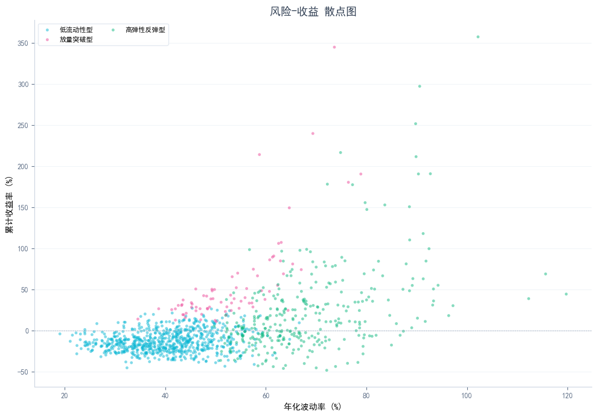
    


```python
# 图7: 最大回撤分布
from dragonflow.viz.charts_matplotlib import plot_max_drawdown_hist

fig = plot_max_drawdown_hist(features_df)
plt.show()
plt.close(fig)
```


    
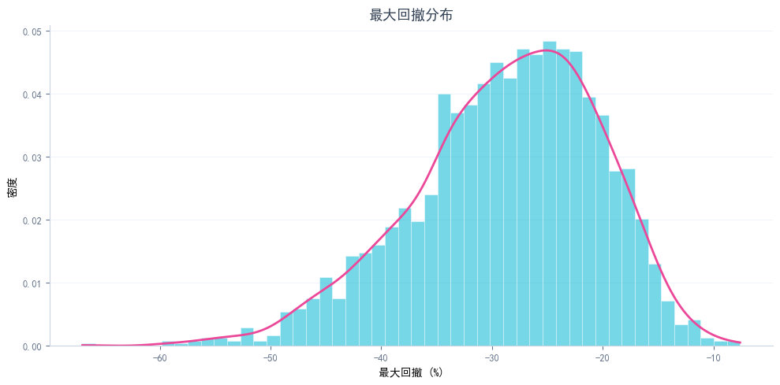
    


```python
# 图8: 偏度 vs 峰度
from dragonflow.viz.charts_matplotlib import plot_skew_kurtosis

fig = plot_skew_kurtosis(features_df)
plt.show()
plt.close(fig)
```


    
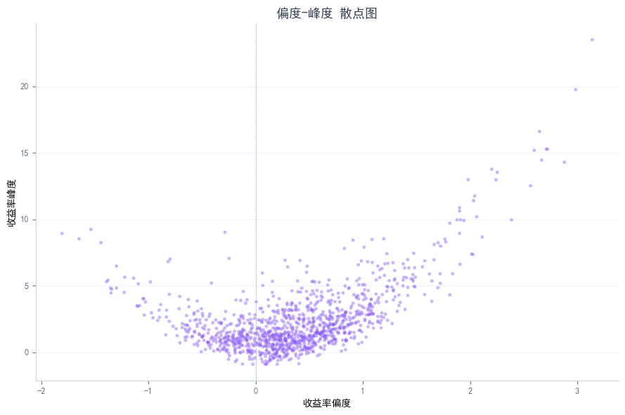
    


```python
# 图9: 月度最大回撤 Top10
from dragonflow.viz.charts_matplotlib import plot_monthly_drawdown_top

fig = plot_monthly_drawdown_top(daily_df)
plt.show()
plt.close(fig)
```


    
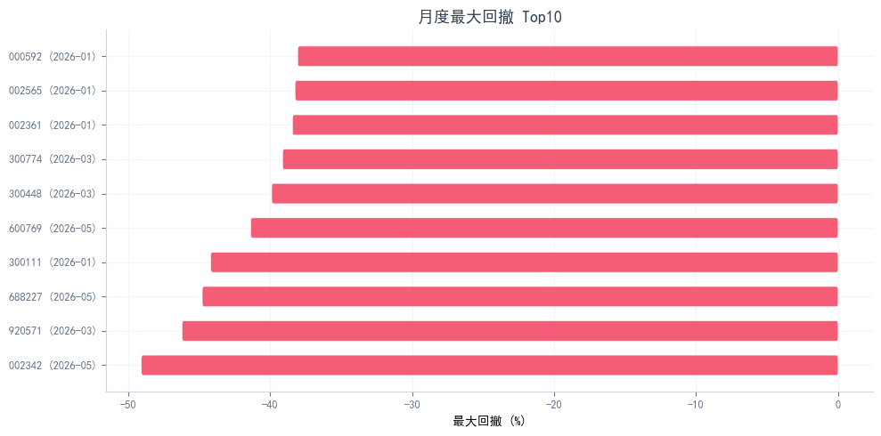
    


---
## Chapter 3: 量价与异动

从换手率、涨跌停、价量关系等维度分析交易行为特征。


```python
# 图10: 换手率 vs 收益率
from dragonflow.viz.charts_matplotlib import plot_turnover_vs_return

fig = plot_turnover_vs_return(features_df)
plt.show()
plt.close(fig)
```


    
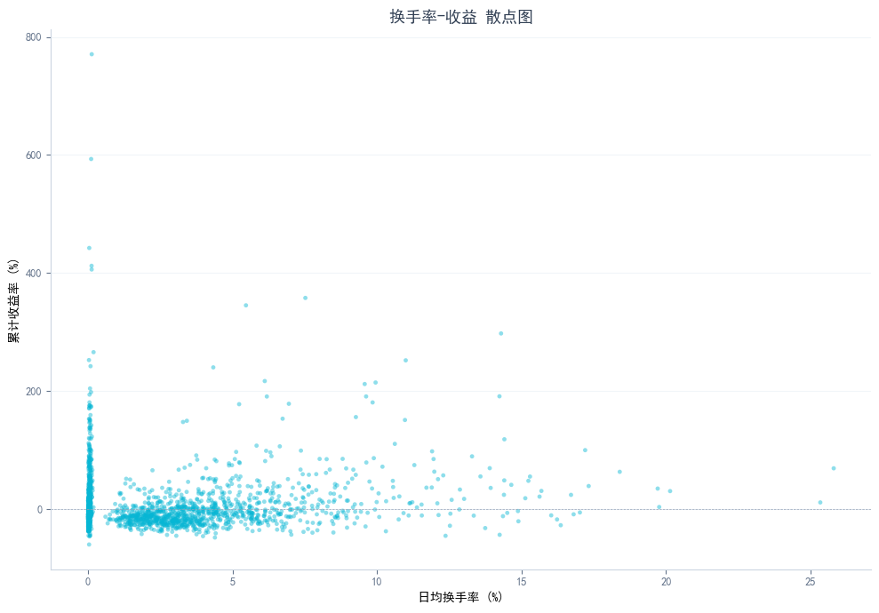
    


```python
# 图11: 涨停/跌停次数 Top20
from dragonflow.viz.charts_matplotlib import plot_limit_up_down_top

fig = plot_limit_up_down_top(features_df)
plt.show()
plt.close(fig)
```


    
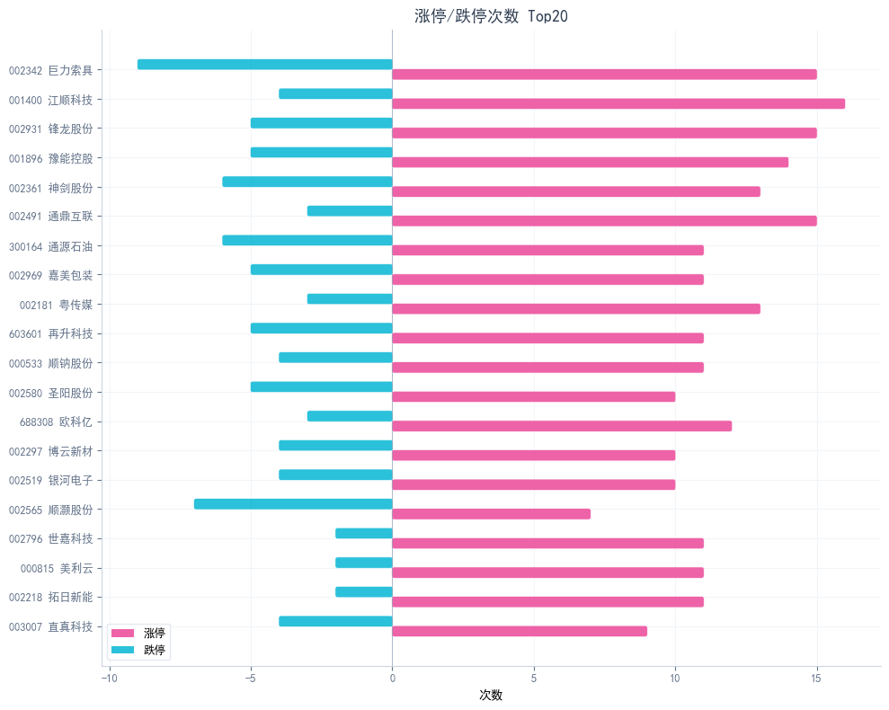
    


```python
# 图12: 价量相关系数分布
from dragonflow.viz.charts_matplotlib import plot_price_volume_corr_hist

fig = plot_price_volume_corr_hist(features_df)
plt.show()
plt.close(fig)
```


    
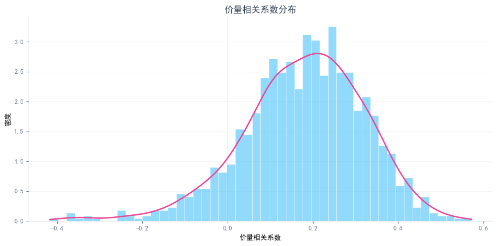
    


---
## Chapter 4: 聚类画像

基于 PCA + KMeans 将2000只股票划分为若干类型，用雷达图和箱线图展示每类特征。


```python
# 图13: PCA 二维聚类散点图
from dragonflow.viz.charts_matplotlib import plot_pca_scatter

if pca_df is not None:
    fig = plot_pca_scatter(pca_df)
    plt.show()
    plt.close(fig)
```


    
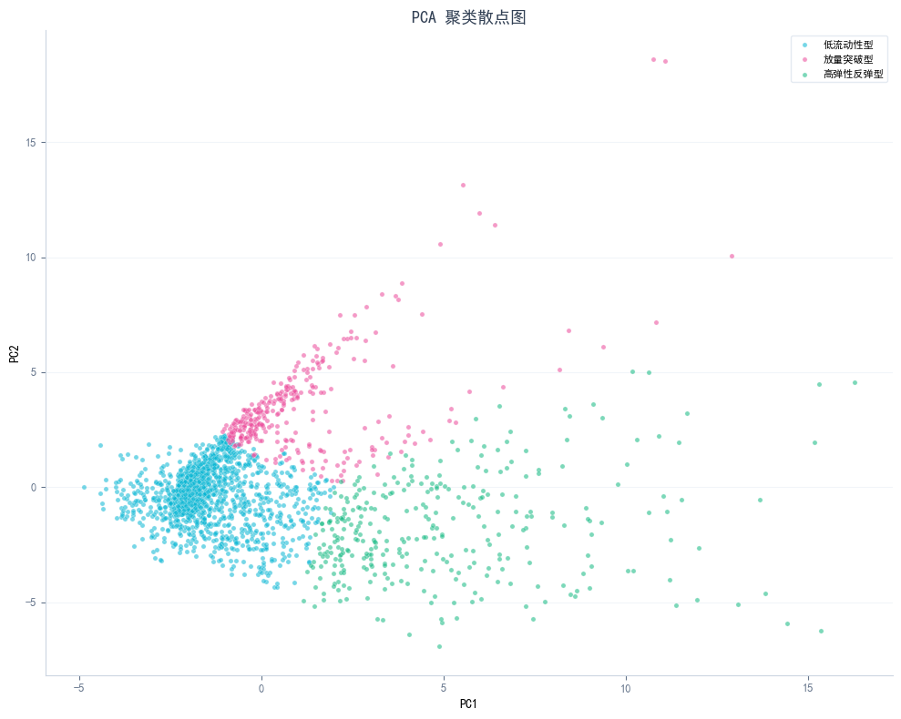
    


```python
# 图14: 聚类雷达图
from dragonflow.viz.charts_pyecharts import chart_cluster_radar

if "cluster_name" in features_df.columns:
    chart_cluster_radar(features_df).render_notebook()
```


```python
# 图15: 肘部法则 + 轮廓系数
from dragonflow.viz.charts_matplotlib import plot_elbow_silhouette

if k_search_df is not None:
    fig = plot_elbow_silhouette(k_search_df)
    plt.show()
    plt.close(fig)
```


    
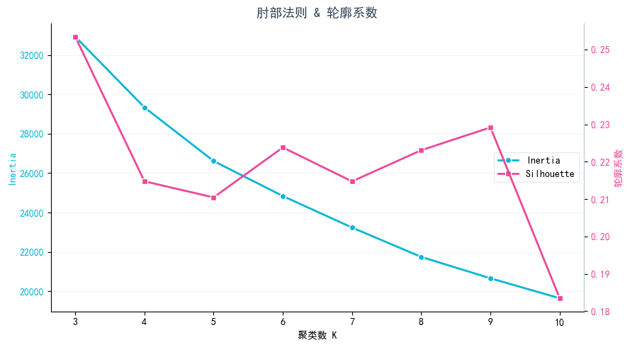
    


```python
# 图16: 聚类特征分组箱线图
from dragonflow.viz.charts_matplotlib import plot_cluster_boxplot

if "cluster_name" in features_df.columns:
    fig = plot_cluster_boxplot(features_df)
    plt.show()
    plt.close(fig)
```


    
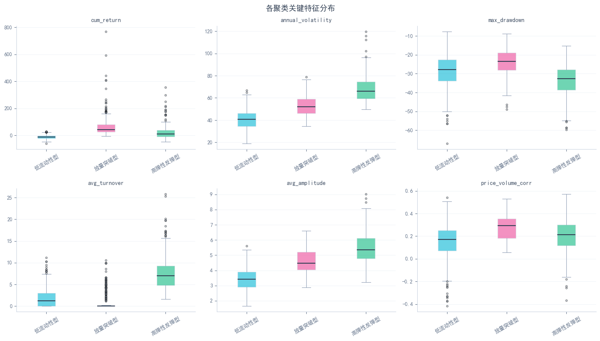
    


---
## Chapter 5: 典型个股

每个聚类选出最具代表性的个股，展示其 K 线走势。


```python
# 选取各聚类代表股
from dragonflow.viz.charts_pyecharts import chart_kline, chart_multi_stock_lines

representatives = {}
if "cluster_name" in features_df.columns:
    for cn, group in features_df.groupby("cluster_name"):
        mean_ret = group["cum_return"].mean()
        closest_idx = (group["cum_return"] - mean_ret).abs().idxmin()
        rep = group.loc[closest_idx]
        code = rep["stock_code"]
        name = rep.get("stock_name", "")
        representatives[cn] = (code, name if isinstance(name, str) else "")
    
    print("各聚类代表股：")
    for cn, (code, name) in representatives.items():
        print(f"  {cn}: {code} {name}")
```

    各聚类代表股：
      低流动性型: 600939 重庆建工
      放量突破型: 688383 新益昌
      高弹性反弹型: 300503 昊志机电
    


```python
# 图17: 各聚类代表股 K线图
for cn, (code, name) in representatives.items():
    print(f"\n--- {cn}: {code} {name} ---")
    chart_kline(daily_df, code, f"{name} ({cn})").render_notebook()
```

    
    --- 低流动性型: 600939 重庆建工 ---
    
    --- 放量突破型: 688383 新益昌 ---
    
    --- 高弹性反弹型: 300503 昊志机电 ---
    


```python
# 图18: 代表股走势叠加对比（归一化）
rep_codes = [code for _, (code, _) in representatives.items()]
rep_names = {code: f"{name}({cn})" for cn, (code, name) in representatives.items()}
chart_multi_stock_lines(daily_df, rep_codes, rep_names).render_notebook()
```


<script>
    require.config({
        paths: {
            'echarts':'https://assets.pyecharts.org/assets/v6/echarts.min'
        }
    });
</script>

        <div id="aeb537ad990046a7893ab7d80e12d90c" style="width:1000px; height:500px;"></div>

<script>
        require(['echarts'], function(echarts) {
                var chart_aeb537ad990046a7893ab7d80e12d90c = echarts.init(
                    document.getElementById('aeb537ad990046a7893ab7d80e12d90c'), 'white', {renderer: 'canvas', locale: 'ZH'});
                var option_aeb537ad990046a7893ab7d80e12d90c = {
    "animation": true,
    "animationThreshold": 2000,
    "animationDuration": 1000,
    "animationEasing": "cubicOut",
    "animationDelay": 0,
    "animationDurationUpdate": 300,
    "animationEasingUpdate": "cubicOut",
    "animationDelayUpdate": 0,
    "aria": {
        "enabled": false
    },
    "series": [
        {
            "type": "line",
            "name": "600939 \u91cd\u5e86\u5efa\u5de5(\u4f4e\u6d41\u52a8\u6027\u578b)",
            "connectNulls": false,
            "xAxisIndex": 0,
            "symbolSize": 3,
            "showSymbol": true,
            "smooth": true,
            "clip": true,
            "step": false,
            "stackStrategy": "samesign",
            "data": [
                [
                    "2026-01-05",
                    100.0
                ],
                [
                    "2026-01-06",
                    101.25
                ],
                [
                    "2026-01-07",
                    100.0
                ],
                [
                    "2026-01-08",
                    101.25
                ],
                [
                    "2026-01-09",
                    101.56
                ],
                [
                    "2026-01-12",
                    102.19
                ],
                [
                    "2026-01-13",
                    102.19
                ],
                [
                    "2026-01-14",
                    100.94
                ],
                [
                    "2026-01-15",
                    99.38
                ],
                [
                    "2026-01-16",
                    98.75
                ],
                [
                    "2026-01-19",
                    97.81
                ],
                [
                    "2026-01-20",
                    103.12
                ],
                [
                    "2026-01-21",
                    100.0
                ],
                [
                    "2026-01-22",
                    100.63
                ],
                [
                    "2026-01-23",
                    101.87
                ],
                [
                    "2026-01-26",
                    100.31
                ],
                [
                    "2026-01-27",
                    99.69
                ],
                [
                    "2026-01-28",
                    99.69
                ],
                [
                    "2026-01-29",
                    100.63
                ],
                [
                    "2026-01-30",
                    98.75
                ],
                [
                    "2026-02-02",
                    96.88
                ],
                [
                    "2026-02-03",
                    98.12
                ],
                [
                    "2026-02-04",
                    99.69
                ],
                [
                    "2026-02-05",
                    99.06
                ],
                [
                    "2026-02-06",
                    99.06
                ],
                [
                    "2026-02-09",
                    100.63
                ],
                [
                    "2026-02-10",
                    100.94
                ],
                [
                    "2026-02-11",
                    100.31
                ],
                [
                    "2026-02-12",
                    98.75
                ],
                [
                    "2026-02-13",
                    101.56
                ],
                [
                    "2026-02-24",
                    101.56
                ],
                [
                    "2026-02-25",
                    103.12
                ],
                [
                    "2026-02-26",
                    101.87
                ],
                [
                    "2026-02-27",
                    103.12
                ],
                [
                    "2026-03-02",
                    100.94
                ],
                [
                    "2026-03-03",
                    99.06
                ],
                [
                    "2026-03-04",
                    97.19
                ],
                [
                    "2026-03-05",
                    98.44
                ],
                [
                    "2026-03-06",
                    101.56
                ],
                [
                    "2026-03-09",
                    100.94
                ],
                [
                    "2026-03-10",
                    101.87
                ],
                [
                    "2026-03-11",
                    102.81
                ],
                [
                    "2026-03-12",
                    102.19
                ],
                [
                    "2026-03-13",
                    103.12
                ],
                [
                    "2026-03-16",
                    100.0
                ],
                [
                    "2026-03-17",
                    100.63
                ],
                [
                    "2026-03-18",
                    98.44
                ],
                [
                    "2026-03-19",
                    96.56
                ],
                [
                    "2026-03-20",
                    94.06
                ],
                [
                    "2026-03-23",
                    88.44
                ],
                [
                    "2026-03-24",
                    92.5
                ],
                [
                    "2026-03-25",
                    96.25
                ],
                [
                    "2026-03-26",
                    94.06
                ],
                [
                    "2026-03-27",
                    95.0
                ],
                [
                    "2026-03-30",
                    95.62
                ],
                [
                    "2026-03-31",
                    97.19
                ],
                [
                    "2026-04-01",
                    96.88
                ],
                [
                    "2026-04-02",
                    95.0
                ],
                [
                    "2026-04-03",
                    90.94
                ],
                [
                    "2026-04-07",
                    92.5
                ],
                [
                    "2026-04-08",
                    94.38
                ],
                [
                    "2026-04-09",
                    91.56
                ],
                [
                    "2026-04-10",
                    91.56
                ],
                [
                    "2026-04-13",
                    91.56
                ],
                [
                    "2026-04-14",
                    92.19
                ],
                [
                    "2026-04-15",
                    90.62
                ],
                [
                    "2026-04-16",
                    90.94
                ],
                [
                    "2026-04-17",
                    90.0
                ],
                [
                    "2026-04-20",
                    89.69
                ],
                [
                    "2026-04-21",
                    90.0
                ],
                [
                    "2026-04-22",
                    89.38
                ],
                [
                    "2026-04-23",
                    89.06
                ],
                [
                    "2026-04-24",
                    88.12
                ],
                [
                    "2026-04-27",
                    88.44
                ],
                [
                    "2026-04-28",
                    89.69
                ],
                [
                    "2026-04-29",
                    92.81
                ],
                [
                    "2026-04-30",
                    95.31
                ],
                [
                    "2026-05-06",
                    96.56
                ],
                [
                    "2026-05-07",
                    95.31
                ],
                [
                    "2026-05-08",
                    96.56
                ],
                [
                    "2026-05-11",
                    95.62
                ],
                [
                    "2026-05-12",
                    94.69
                ],
                [
                    "2026-05-13",
                    95.31
                ],
                [
                    "2026-05-14",
                    92.81
                ],
                [
                    "2026-05-15",
                    91.56
                ],
                [
                    "2026-05-18",
                    92.19
                ],
                [
                    "2026-05-19",
                    92.81
                ],
                [
                    "2026-05-20",
                    90.94
                ],
                [
                    "2026-05-21",
                    85.62
                ],
                [
                    "2026-05-22",
                    87.19
                ],
                [
                    "2026-05-25",
                    87.5
                ],
                [
                    "2026-05-26",
                    85.31
                ],
                [
                    "2026-05-27",
                    85.0
                ],
                [
                    "2026-05-28",
                    86.56
                ],
                [
                    "2026-05-29",
                    87.5
                ]
            ],
            "hoverAnimation": true,
            "label": {
                "show": false,
                "margin": 8,
                "richInheritPlainLabel": true,
                "valueAnimation": false
            },
            "logBase": 10,
            "seriesLayoutBy": "column",
            "lineStyle": {
                "show": false
            },
            "areaStyle": {
                "opacity": 0
            },
            "zlevel": 0,
            "z": 0
        },
        {
            "type": "line",
            "name": "688383 \u65b0\u76ca\u660c(\u653e\u91cf\u7a81\u7834\u578b)",
            "connectNulls": false,
            "xAxisIndex": 0,
            "symbolSize": 3,
            "showSymbol": true,
            "smooth": true,
            "clip": true,
            "step": false,
            "stackStrategy": "samesign",
            "data": [
                [
                    "2026-01-05",
                    100.0
                ],
                [
                    "2026-01-06",
                    100.11
                ],
                [
                    "2026-01-07",
                    99.57
                ],
                [
                    "2026-01-08",
                    99.55
                ],
                [
                    "2026-01-09",
                    95.63
                ],
                [
                    "2026-01-12",
                    95.49
                ],
                [
                    "2026-01-13",
                    93.36
                ],
                [
                    "2026-01-14",
                    95.96
                ],
                [
                    "2026-01-15",
                    99.68
                ],
                [
                    "2026-01-16",
                    104.82
                ],
                [
                    "2026-01-19",
                    103.0
                ],
                [
                    "2026-01-20",
                    99.95
                ],
                [
                    "2026-01-21",
                    102.14
                ],
                [
                    "2026-01-22",
                    100.32
                ],
                [
                    "2026-01-23",
                    102.49
                ],
                [
                    "2026-01-26",
                    95.17
                ],
                [
                    "2026-01-27",
                    95.9
                ],
                [
                    "2026-01-28",
                    94.56
                ],
                [
                    "2026-01-29",
                    94.26
                ],
                [
                    "2026-01-30",
                    93.19
                ],
                [
                    "2026-02-02",
                    88.06
                ],
                [
                    "2026-02-03",
                    91.95
                ],
                [
                    "2026-02-04",
                    89.48
                ],
                [
                    "2026-02-05",
                    88.69
                ],
                [
                    "2026-02-06",
                    89.06
                ],
                [
                    "2026-02-09",
                    90.94
                ],
                [
                    "2026-02-10",
                    89.95
                ],
                [
                    "2026-02-11",
                    89.02
                ],
                [
                    "2026-02-12",
                    89.27
                ],
                [
                    "2026-02-13",
                    90.57
                ],
                [
                    "2026-02-24",
                    89.9
                ],
                [
                    "2026-02-25",
                    92.32
                ],
                [
                    "2026-02-26",
                    92.19
                ],
                [
                    "2026-02-27",
                    92.99
                ],
                [
                    "2026-03-02",
                    88.97
                ],
                [
                    "2026-03-03",
                    82.89
                ],
                [
                    "2026-03-04",
                    81.34
                ],
                [
                    "2026-03-05",
                    94.35
                ],
                [
                    "2026-03-06",
                    92.55
                ],
                [
                    "2026-03-09",
                    89.2
                ],
                [
                    "2026-03-10",
                    92.34
                ],
                [
                    "2026-03-11",
                    92.37
                ],
                [
                    "2026-03-12",
                    94.78
                ],
                [
                    "2026-03-13",
                    90.86
                ],
                [
                    "2026-03-16",
                    88.69
                ],
                [
                    "2026-03-17",
                    85.03
                ],
                [
                    "2026-03-18",
                    87.19
                ],
                [
                    "2026-03-19",
                    82.85
                ],
                [
                    "2026-03-20",
                    81.75
                ],
                [
                    "2026-03-23",
                    74.35
                ],
                [
                    "2026-03-24",
                    77.62
                ],
                [
                    "2026-03-25",
                    83.26
                ],
                [
                    "2026-03-26",
                    81.77
                ],
                [
                    "2026-03-27",
                    83.58
                ],
                [
                    "2026-03-30",
                    91.17
                ],
                [
                    "2026-03-31",
                    93.62
                ],
                [
                    "2026-04-01",
                    100.58
                ],
                [
                    "2026-04-02",
                    106.36
                ],
                [
                    "2026-04-03",
                    108.4
                ],
                [
                    "2026-04-07",
                    112.08
                ],
                [
                    "2026-04-08",
                    110.23
                ],
                [
                    "2026-04-09",
                    117.94
                ],
                [
                    "2026-04-10",
                    120.18
                ],
                [
                    "2026-04-13",
                    118.89
                ],
                [
                    "2026-04-14",
                    117.93
                ],
                [
                    "2026-04-15",
                    117.95
                ],
                [
                    "2026-04-16",
                    116.78
                ],
                [
                    "2026-04-17",
                    119.58
                ],
                [
                    "2026-04-20",
                    121.17
                ],
                [
                    "2026-04-21",
                    126.51
                ],
                [
                    "2026-04-22",
                    127.53
                ],
                [
                    "2026-04-23",
                    123.65
                ],
                [
                    "2026-04-24",
                    124.12
                ],
                [
                    "2026-04-27",
                    125.36
                ],
                [
                    "2026-04-28",
                    123.96
                ],
                [
                    "2026-04-29",
                    124.42
                ],
                [
                    "2026-04-30",
                    125.39
                ],
                [
                    "2026-05-06",
                    120.89
                ],
                [
                    "2026-05-07",
                    125.39
                ],
                [
                    "2026-05-08",
                    126.23
                ],
                [
                    "2026-05-11",
                    126.24
                ],
                [
                    "2026-05-12",
                    135.01
                ],
                [
                    "2026-05-13",
                    149.83
                ],
                [
                    "2026-05-14",
                    163.05
                ],
                [
                    "2026-05-15",
                    156.08
                ],
                [
                    "2026-05-18",
                    156.36
                ],
                [
                    "2026-05-19",
                    164.54
                ],
                [
                    "2026-05-20",
                    172.94
                ],
                [
                    "2026-05-21",
                    164.79
                ],
                [
                    "2026-05-22",
                    168.49
                ],
                [
                    "2026-05-25",
                    175.77
                ],
                [
                    "2026-05-26",
                    180.58
                ],
                [
                    "2026-05-27",
                    186.38
                ],
                [
                    "2026-05-28",
                    189.57
                ],
                [
                    "2026-05-29",
                    168.85
                ]
            ],
            "hoverAnimation": true,
            "label": {
                "show": false,
                "margin": 8,
                "richInheritPlainLabel": true,
                "valueAnimation": false
            },
            "logBase": 10,
            "seriesLayoutBy": "column",
            "lineStyle": {
                "show": false
            },
            "areaStyle": {
                "opacity": 0
            },
            "zlevel": 0,
            "z": 0
        },
        {
            "type": "line",
            "name": "300503 \u660a\u5fd7\u673a\u7535(\u9ad8\u5f39\u6027\u53cd\u5f39\u578b)",
            "connectNulls": false,
            "xAxisIndex": 0,
            "symbolSize": 3,
            "showSymbol": true,
            "smooth": true,
            "clip": true,
            "step": false,
            "stackStrategy": "samesign",
            "data": [
                [
                    "2026-01-05",
                    100.0
                ],
                [
                    "2026-01-06",
                    102.06
                ],
                [
                    "2026-01-07",
                    98.28
                ],
                [
                    "2026-01-08",
                    100.23
                ],
                [
                    "2026-01-09",
                    107.02
                ],
                [
                    "2026-01-12",
                    114.22
                ],
                [
                    "2026-01-13",
                    103.7
                ],
                [
                    "2026-01-14",
                    101.29
                ],
                [
                    "2026-01-15",
                    99.27
                ],
                [
                    "2026-01-16",
                    103.73
                ],
                [
                    "2026-01-19",
                    111.29
                ],
                [
                    "2026-01-20",
                    105.53
                ],
                [
                    "2026-01-21",
                    108.62
                ],
                [
                    "2026-01-22",
                    110.9
                ],
                [
                    "2026-01-23",
                    118.15
                ],
                [
                    "2026-01-26",
                    101.72
                ],
                [
                    "2026-01-27",
                    97.92
                ],
                [
                    "2026-01-28",
                    95.13
                ],
                [
                    "2026-01-29",
                    92.31
                ],
                [
                    "2026-01-30",
                    91.6
                ],
                [
                    "2026-02-02",
                    94.2
                ],
                [
                    "2026-02-03",
                    96.19
                ],
                [
                    "2026-02-04",
                    93.31
                ],
                [
                    "2026-02-05",
                    90.14
                ],
                [
                    "2026-02-06",
                    91.58
                ],
                [
                    "2026-02-09",
                    92.88
                ],
                [
                    "2026-02-10",
                    94.45
                ],
                [
                    "2026-02-11",
                    90.65
                ],
                [
                    "2026-02-12",
                    90.67
                ],
                [
                    "2026-02-13",
                    91.03
                ],
                [
                    "2026-02-24",
                    87.75
                ],
                [
                    "2026-02-25",
                    90.87
                ],
                [
                    "2026-02-26",
                    90.14
                ],
                [
                    "2026-02-27",
                    87.62
                ],
                [
                    "2026-03-02",
                    85.95
                ],
                [
                    "2026-03-03",
                    79.82
                ],
                [
                    "2026-03-04",
                    79.85
                ],
                [
                    "2026-03-05",
                    81.72
                ],
                [
                    "2026-03-06",
                    81.41
                ],
                [
                    "2026-03-09",
                    80.85
                ],
                [
                    "2026-03-10",
                    83.72
                ],
                [
                    "2026-03-11",
                    83.7
                ],
                [
                    "2026-03-12",
                    81.39
                ],
                [
                    "2026-03-13",
                    79.29
                ],
                [
                    "2026-03-16",
                    83.29
                ],
                [
                    "2026-03-17",
                    85.19
                ],
                [
                    "2026-03-18",
                    87.65
                ],
                [
                    "2026-03-19",
                    82.61
                ],
                [
                    "2026-03-20",
                    81.95
                ],
                [
                    "2026-03-23",
                    77.08
                ],
                [
                    "2026-03-24",
                    76.49
                ],
                [
                    "2026-03-25",
                    77.38
                ],
                [
                    "2026-03-26",
                    77.0
                ],
                [
                    "2026-03-27",
                    77.03
                ],
                [
                    "2026-03-30",
                    81.77
                ],
                [
                    "2026-03-31",
                    85.75
                ],
                [
                    "2026-04-01",
                    91.2
                ],
                [
                    "2026-04-02",
                    89.5
                ],
                [
                    "2026-04-03",
                    87.45
                ],
                [
                    "2026-04-07",
                    86.21
                ],
                [
                    "2026-04-08",
                    90.57
                ],
                [
                    "2026-04-09",
                    87.71
                ],
                [
                    "2026-04-10",
                    86.53
                ],
                [
                    "2026-04-13",
                    90.11
                ],
                [
                    "2026-04-14",
                    93.11
                ],
                [
                    "2026-04-15",
                    90.82
                ],
                [
                    "2026-04-16",
                    92.92
                ],
                [
                    "2026-04-17",
                    97.74
                ],
                [
                    "2026-04-20",
                    102.94
                ],
                [
                    "2026-04-21",
                    100.79
                ],
                [
                    "2026-04-22",
                    103.83
                ],
                [
                    "2026-04-23",
                    100.15
                ],
                [
                    "2026-04-24",
                    104.89
                ],
                [
                    "2026-04-27",
                    103.75
                ],
                [
                    "2026-04-28",
                    107.17
                ],
                [
                    "2026-04-29",
                    106.18
                ],
                [
                    "2026-04-30",
                    103.29
                ],
                [
                    "2026-05-06",
                    108.8
                ],
                [
                    "2026-05-07",
                    110.58
                ],
                [
                    "2026-05-08",
                    112.93
                ],
                [
                    "2026-05-11",
                    120.05
                ],
                [
                    "2026-05-12",
                    114.32
                ],
                [
                    "2026-05-13",
                    113.9
                ],
                [
                    "2026-05-14",
                    112.78
                ],
                [
                    "2026-05-15",
                    117.31
                ],
                [
                    "2026-05-18",
                    115.31
                ],
                [
                    "2026-05-19",
                    130.25
                ],
                [
                    "2026-05-20",
                    125.07
                ],
                [
                    "2026-05-21",
                    143.44
                ],
                [
                    "2026-05-22",
                    147.36
                ],
                [
                    "2026-05-25",
                    145.31
                ],
                [
                    "2026-05-26",
                    139.37
                ],
                [
                    "2026-05-27",
                    131.75
                ],
                [
                    "2026-05-28",
                    129.81
                ],
                [
                    "2026-05-29",
                    121.37
                ]
            ],
            "hoverAnimation": true,
            "label": {
                "show": false,
                "margin": 8,
                "richInheritPlainLabel": true,
                "valueAnimation": false
            },
            "logBase": 10,
            "seriesLayoutBy": "column",
            "lineStyle": {
                "show": false
            },
            "areaStyle": {
                "opacity": 0
            },
            "zlevel": 0,
            "z": 0
        }
    ],
    "legend": [
        {
            "data": [
                "600939 \u91cd\u5e86\u5efa\u5de5(\u4f4e\u6d41\u52a8\u6027\u578b)",
                "688383 \u65b0\u76ca\u660c(\u653e\u91cf\u7a81\u7834\u578b)",
                "300503 \u660a\u5fd7\u673a\u7535(\u9ad8\u5f39\u6027\u53cd\u5f39\u578b)"
            ],
            "selected": {},
            "type": "scroll",
            "show": true,
            "bottom": "0%",
            "padding": 5,
            "itemGap": 10,
            "itemWidth": 25,
            "itemHeight": 14,
            "backgroundColor": "transparent",
            "borderColor": "#ccc",
            "borderRadius": 0,
            "pageButtonItemGap": 5,
            "pageButtonPosition": "end",
            "pageFormatter": "{current}/{total}",
            "pageIconColor": "#2f4554",
            "pageIconInactiveColor": "#aaa",
            "pageIconSize": 15,
            "animationDurationUpdate": 800,
            "selector": false,
            "selectorPosition": "auto",
            "selectorItemGap": 7,
            "selectorButtonGap": 10,
            "triggerEvent": false
        }
    ],
    "tooltip": {
        "show": true,
        "trigger": "axis",
        "triggerOn": "mousemove|click",
        "axisPointer": {
            "type": "line"
        },
        "showContent": true,
        "alwaysShowContent": false,
        "showDelay": 0,
        "hideDelay": 100,
        "enterable": false,
        "confine": false,
        "appendToBody": false,
        "transitionDuration": 0.4,
        "displayTransition": true,
        "textStyle": {
            "fontSize": 14,
            "richInheritPlainLabel": true
        },
        "borderWidth": 0,
        "padding": 5,
        "order": "seriesAsc"
    },
    "xAxis": [
        {
            "show": true,
            "scale": false,
            "nameLocation": "end",
            "nameGap": 15,
            "nameTruncate": {},
            "nameMoveOverlap": true,
            "inverse": false,
            "offset": 0,
            "splitNumber": 5,
            "minInterval": 0,
            "silent": false,
            "triggerEvent": false,
            "splitLine": {
                "show": true,
                "lineStyle": {
                    "show": false
                }
            },
            "animation": true,
            "animationThreshold": 2000,
            "animationDuration": 1000,
            "animationEasing": "cubicOut",
            "animationDelay": 0,
            "animationDurationUpdate": 300,
            "animationEasingUpdate": "cubicOut",
            "animationDelayUpdate": 0,
            "data": [
                "2026-01-05",
                "2026-01-06",
                "2026-01-07",
                "2026-01-08",
                "2026-01-09",
                "2026-01-12",
                "2026-01-13",
                "2026-01-14",
                "2026-01-15",
                "2026-01-16",
                "2026-01-19",
                "2026-01-20",
                "2026-01-21",
                "2026-01-22",
                "2026-01-23",
                "2026-01-26",
                "2026-01-27",
                "2026-01-28",
                "2026-01-29",
                "2026-01-30",
                "2026-02-02",
                "2026-02-03",
                "2026-02-04",
                "2026-02-05",
                "2026-02-06",
                "2026-02-09",
                "2026-02-10",
                "2026-02-11",
                "2026-02-12",
                "2026-02-13",
                "2026-02-24",
                "2026-02-25",
                "2026-02-26",
                "2026-02-27",
                "2026-03-02",
                "2026-03-03",
                "2026-03-04",
                "2026-03-05",
                "2026-03-06",
                "2026-03-09",
                "2026-03-10",
                "2026-03-11",
                "2026-03-12",
                "2026-03-13",
                "2026-03-16",
                "2026-03-17",
                "2026-03-18",
                "2026-03-19",
                "2026-03-20",
                "2026-03-23",
                "2026-03-24",
                "2026-03-25",
                "2026-03-26",
                "2026-03-27",
                "2026-03-30",
                "2026-03-31",
                "2026-04-01",
                "2026-04-02",
                "2026-04-03",
                "2026-04-07",
                "2026-04-08",
                "2026-04-09",
                "2026-04-10",
                "2026-04-13",
                "2026-04-14",
                "2026-04-15",
                "2026-04-16",
                "2026-04-17",
                "2026-04-20",
                "2026-04-21",
                "2026-04-22",
                "2026-04-23",
                "2026-04-24",
                "2026-04-27",
                "2026-04-28",
                "2026-04-29",
                "2026-04-30",
                "2026-05-06",
                "2026-05-07",
                "2026-05-08",
                "2026-05-11",
                "2026-05-12",
                "2026-05-13",
                "2026-05-14",
                "2026-05-15",
                "2026-05-18",
                "2026-05-19",
                "2026-05-20",
                "2026-05-21",
                "2026-05-22",
                "2026-05-25",
                "2026-05-26",
                "2026-05-27",
                "2026-05-28",
                "2026-05-29"
            ]
        }
    ],
    "yAxis": [
        {
            "name": "\u5f52\u4e00\u5316\u4ef7\u683c",
            "show": true,
            "scale": true,
            "nameLocation": "end",
            "nameGap": 15,
            "nameTruncate": {},
            "nameMoveOverlap": true,
            "inverse": false,
            "offset": 0,
            "splitNumber": 5,
            "minInterval": 0,
            "silent": false,
            "triggerEvent": false,
            "splitLine": {
                "show": true,
                "lineStyle": {
                    "show": false
                }
            },
            "animation": true,
            "animationThreshold": 2000,
            "animationDuration": 1000,
            "animationEasing": "cubicOut",
            "animationDelay": 0,
            "animationDurationUpdate": 300,
            "animationEasingUpdate": "cubicOut",
            "animationDelayUpdate": 0
        }
    ],
    "title": [
        {
            "show": true,
            "text": "\u4ee3\u8868\u80a1\u8d70\u52bf\u5bf9\u6bd4\uff08\u5f52\u4e00\u5316\uff09",
            "target": "blank",
            "subtarget": "blank",
            "padding": 5,
            "itemGap": 10,
            "textAlign": "auto",
            "textVerticalAlign": "auto",
            "triggerEvent": false
        }
    ],
    "dataZoom": [
        {
            "show": true,
            "type": "slider",
            "showDetail": true,
            "showDataShadow": true,
            "realtime": true,
            "start": 0,
            "end": 100,
            "orient": "horizontal",
            "zoomLock": false,
            "filterMode": "filter"
        }
    ]
};
                chart_aeb537ad990046a7893ab7d80e12d90c.setOption(option_aeb537ad990046a7893ab7d80e12d90c);
        });
    </script>


---
## 聚类结果汇总


```python
if "cluster_name" in features_df.columns:
    display_df = features_df.groupby("cluster_name").agg(
        股票数量=("stock_code", "count"),
        平均收益率=("cum_return", "mean"),
        平均波动率=("annual_volatility", "mean"),
        平均最大回撤=("max_drawdown", "mean"),
        平均换手率=("avg_turnover", "mean"),
        平均振幅=("avg_amplitude", "mean"),
    ).round(2)
    
    print("中证2000成分股 聚类画像汇总")
    print("=" * 60)
    display(display_df)
```

    中证2000成分股 聚类画像汇总
    ============================================================
    


<div>
<style scoped>
    .dataframe tbody tr th:only-of-type {
        vertical-align: middle;
    }

    .dataframe tbody tr th {
        vertical-align: top;
    }

    .dataframe thead th {
        text-align: right;
    }
</style>
<table border="1" class="dataframe">
  <thead>
    <tr style="text-align: right;">
      <th></th>
      <th>股票数量</th>
      <th>平均收益率</th>
      <th>平均波动率</th>
      <th>平均最大回撤</th>
      <th>平均换手率</th>
      <th>平均振幅</th>
    </tr>
    <tr>
      <th>cluster_name</th>
      <th></th>
      <th></th>
      <th></th>
      <th></th>
      <th></th>
      <th></th>
    </tr>
  </thead>
  <tbody>
    <tr>
      <th>低流动性型</th>
      <td>1362</td>
      <td>-12.50</td>
      <td>40.54</td>
      <td>-28.62</td>
      <td>1.71</td>
      <td>3.42</td>
    </tr>
    <tr>
      <th>放量突破型</th>
      <td>312</td>
      <td>67.92</td>
      <td>53.21</td>
      <td>-24.06</td>
      <td>1.09</td>
      <td>4.60</td>
    </tr>
    <tr>
      <th>高弹性反弹型</th>
      <td>326</td>
      <td>21.43</td>
      <td>68.20</td>
      <td>-33.71</td>
      <td>7.79</td>
      <td>5.53</td>
    </tr>
  </tbody>
</table>
</div>


---

**分析完成。** 以上图表从大盘全景、风险收益、量价异动、聚类画像和典型个股五个角度，系统描述了中证2000成分股在2026年1-5月的市场行为特征。
